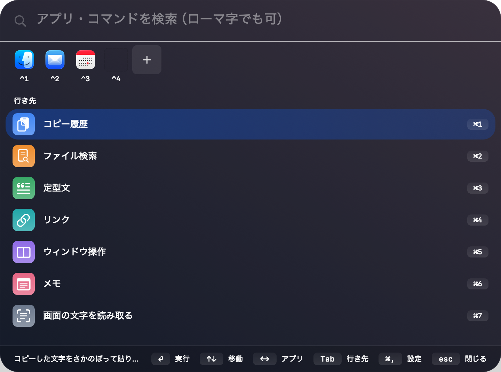

# テモト（Temoto）

<p align="center"></p>

キーボードから手を離さずに、アプリ起動・コピー履歴・定型文・ファイル検索・計算・画面キャプチャまで届く、**日本語のためのシンプルなランチャー**です。macOS 14 以降。

> **Temoto** is a simple, Japanese-first launcher for macOS: app launching, clipboard history, text snippets, file search, calculator and screen capture from one window. Zero network access, zero third-party dependencies. The UI is currently Japanese-only.

## 考え方

- **通信ゼロ。** 打った言葉も、コピーの中身も、どこにも送りません
- **使うものだけ出す。** はじめは最小構成（検索・コピー履歴・ファイル検索・定型文）。リンク・ウィンドウ操作・計算などは、設定の「使う機能」で足せます
- **日本語で探せる。** ローマ字でも、ひらがなでも、読みがなでも当たります（`teikei` → 定型文）
- **外部ライブラリ 0 個。** 依存が無いので、読めば全部わかります

## 主な機能

| キー | 機能 |
|------|------|
| `⌥Space` | 検索窓を開く（変更できます） |
| `⌘1` | コピー履歴 — 暗号化して保存。複数選んでまとめて貼れます（`⇧↑↓`） |
| `⌘2` | ファイル検索 — 「請求書 pdf 今月」「中身:見積」と日本語のまま |
| `⌘3` | 定型文 — 合言葉で呼び出し。どのアプリでも自動展開（設定 → 使う機能 → 合言葉の自動展開） |
| `⌘4` | メモ／画面の文字を読み取る（OCR） ほか |

画面キャプチャは「範囲・全体・ウィンドウ・**スクロールしてページ全体**」の4種類。撮ったものはコピー履歴に残り、写った文字で検索できます。

## 入れ方

> ⚠️ **配布物（.dmg）は準備中です**（Apple の公証を申請中）。
> それまでは下の [自分でビルドする](#自分でビルドする) でそのまま動かせます（Xcode 不要・3コマンド）。

1. [Releases](../../releases) から `Temoto-x.y.z.dmg` を開き、テモトを「アプリケーション」へドラッグ
2. 起動すると検索窓が開きます。窓を出すキーは既定で `⌥Space`
3. 機能によって macOS の許可が要ります（**使うときに**理由と一緒に案内が出ます）
   - ウィンドウ操作・合言葉の自動展開 → アクセシビリティ
   - 画面全体・ページ全体の撮影 → 画面収録

## 更新について

自動更新はありません（**通信ゼロ**のためです）。新しい版は Releases で配布します（公証の完了後）。

## アンインストール

1. アプリケーションから「テモト」を削除
2. `~/Library/Application Support/Temoto/` を削除（履歴・定型文・設定）
3. キーチェーンアクセスで `jp.zerocloud.temoto` を検索して削除（暗号鍵）
4. システム設定 → 一般 → ログイン項目から「テモト」を外す

## 構成

| ターゲット | 中身 |
|---|---|
| `TemotoCore` | AppKit に依存しない純ロジック。判定・計算・保存の決まりは全部ここ |
| `Temoto` | アプリ本体。画面・キー・macOS の許可など AppKit に触れる部分だけ |
| `TemotoChecks` | 自作の検証ランナー。2,500件以上を数秒で回す |

AppKit に触れない部分を全部 `TemotoCore` に寄せてあるので、**Xcode を入れずコマンドラインだけで検証できます**。
XCTest ではなく自作ランナーにしているのはそのためです。外部ライブラリは0個です。

`Sources/Temoto/` の `*Check.swift` / `*Preview.swift` / `DesignIcon.swift` は製品の画面ではなく、
開発用の入口です（`Sources/Temoto/main.swift` の引数分岐から起動します）。

## 自分でビルドする

Xcode 本体は不要です（Command Line Tools のみで動きます）。

```bash
swift build
swift run TemotoChecks   # 自作の検証ランナー。全件通過が .app 作成の条件
scripts/build-app.sh     # ~/Applications/Temoto.app を作る
```

Developer ID の証明書が無い環境では **ad-hoc 署名**になります。この場合、作り直すたびに
macOS が「別のアプリ」と見なすため、次のことが起こります。

- アクセシビリティ・画面収録の許可を入れ直す必要があります
- 暗号鍵が引き継げず、コピー履歴・定型文・メモは空から始まります
  （`build-app.sh` が古いビルドから定型文とメモを取り出して引き継ぎますが、履歴は引き継ぎません）

## 貢献について

Issue・PR は歓迎します。ただし次の3つは**意図的な方針**なので、変更の提案前にご一読ください。

- 外部ライブラリを増やさない（依存0個・通信0を保つため）
- XCTest を使わない（Xcode 無しで検証を回せるようにするため）
- 日本語で「なぜそうしたか」のコメントを残す（過去の失敗の記録を消さない）

PR の前に `swift run TemotoChecks` を全件通してください。

## ライセンス

[MIT](LICENSE) — 開発・配布: 上田純市郎（Zerocloud）
